# Gigis Yarn
Gigis Yarn is designed to be a digital gallery for handmade crochet artwork. On the site users will find handmade baby toys and accessories. The site is for inspirational purposes and user can even buy items or patterns. 

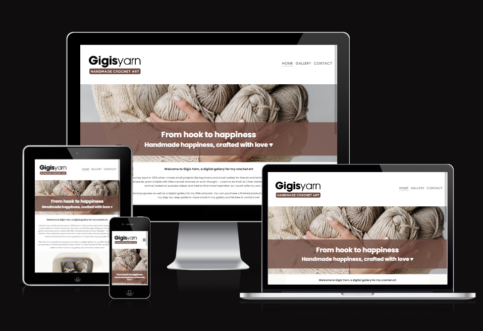

----------------------------------------------------
## User Stories
### First time visitors:
An inspirational page for someone interested in crochet.
Puschase finished products or the pattern. 
Contact me for any requests or questions.

### Returning visitors:
Find inspiration from updated information/images
Purchase finished products and patterns

### Others: 
Potentional customer wanting to know prices and what else is offered

## Site Administrator
The site should be organised, easy to navigate and to easy to update information and new images to the gallery.
----------------------------------------------------

## Wireframe
The outcome from the Wireframes I made at the beginning has changed a bit from how the end product looked like. Nothing major, changed text-content placement etc. 
I also added the thanks-page which I didn't plan for when I made the wireframes:

### Mobile Wireframes:
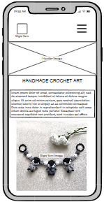 
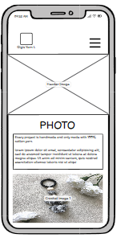
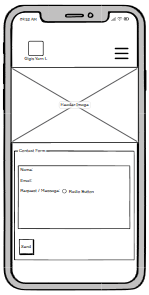

### Tablet Wireframes:
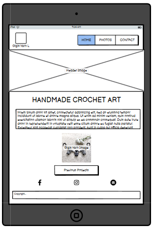
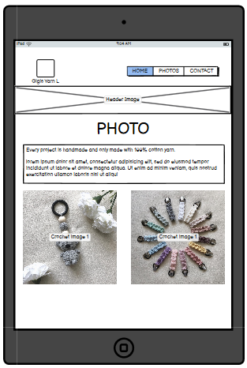
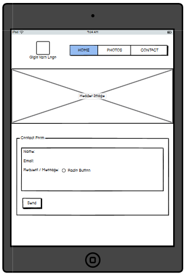

### Desktop Wireframes:
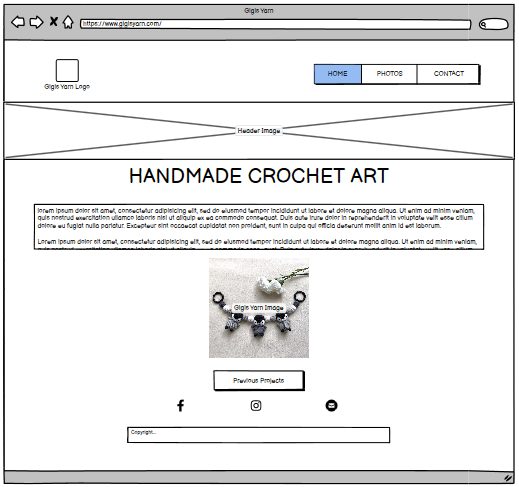
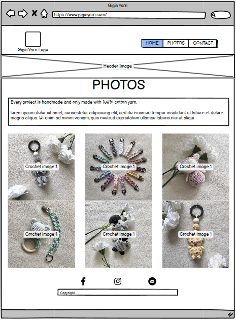
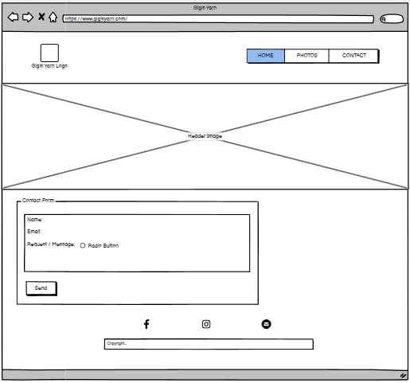

## Features
The site features a clear and simpel design that includes a navbar at the top next to the logo. In the navbar there is a menu (burger-menu for mobile-devices and buttons for other larger devices) with three buttons – Home, Photos and Contact. There is also a footer containing working icons of Facebook, Instagram and Contact.  

- Homepage: Contains a description of Gigis Yarn. 
- Gallery: Shows photos of my previous works. 
- Contact: A form for contact, when submitted there will be a thank you page and a button to go back to homepage. 

### Homepage
Home page contains information about Gigis Yarn, how it started, what is offered and a button going to the gallery page. 
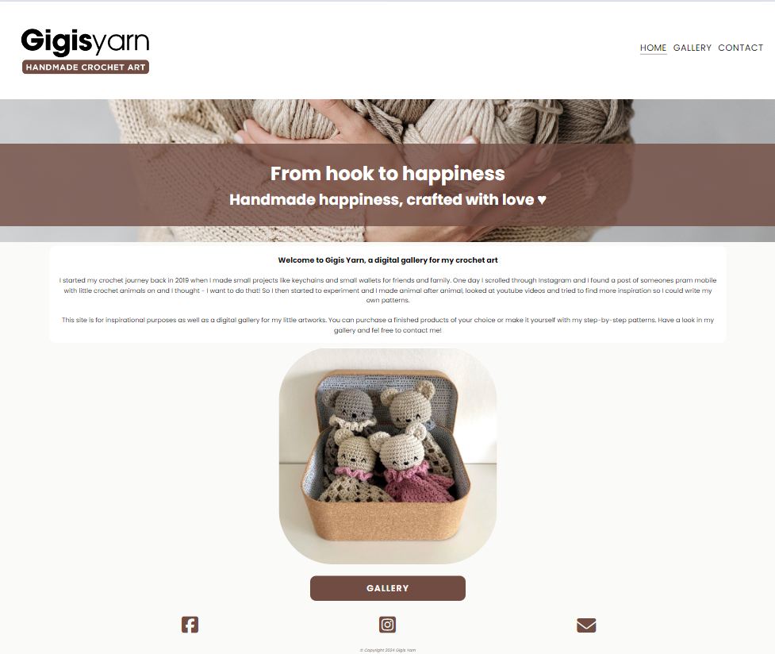

### Gallery 
The gallery page features images of what is offered. There's also a button at the bottom of the page to the contact page.
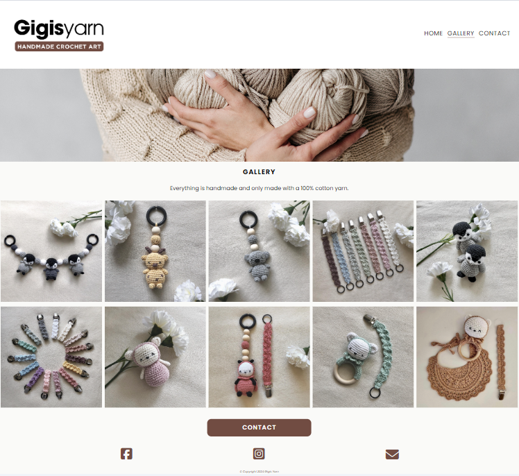

### Contact
The page contains of a form where you fill in your name, email and the request your having. It also contains a submit button, when clicked you'll be redirected to the thanks page.
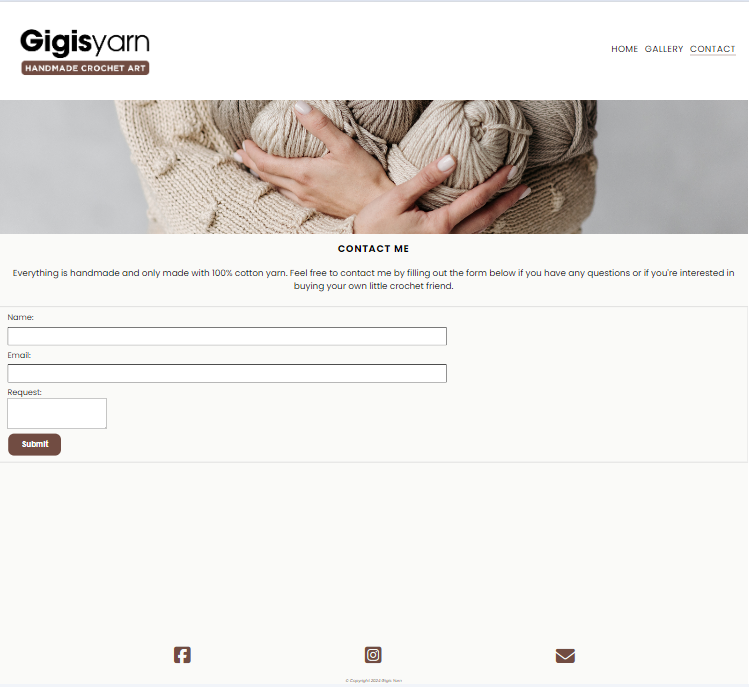

### Thanks
When submitting the form you will be redirected to the thanks site which has a Thank you note and a button to get back to the Home page. 
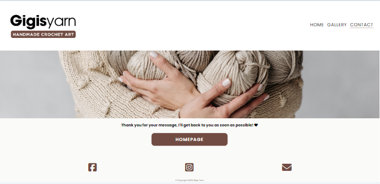

## Design
### Colour scheme
- #000000
- #2B1A05
- #714C42
- #FAFAF8

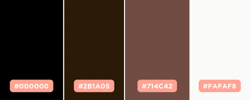

Color palette created using Canva.
The colors are very neutral with a lot of brown and beige colors, this is to match all the colors in the photos and let the photos "decorate" the site. 

### Font family
For the logo (made in Canva) I used ITC Avant Garde Gothic and Gothham.
For the rest of the site I used the linked Google Fonts with Poppins and the the fallback font is sans-serif. 
Bold was used mainly on the button texts with a weight of 900. 

## Future Features
- Making the images on the Gallery page clickable to either enlarge the picture or find more information. 
- Making an add to cart for user to purchase already finished products or patterns.

## Languages, content and resources:
- HTML5 Markup language, used to make the site 
- CSS Used to style most parts of the site 
- Github Repository 
- Gitpod IDE to make the site 
- FontAwesome Where icons on the site is used from 
- Favicon Where icon in tab is used from 
- Google Fonts Where I have taken the fonts from 
- Balwamiq Wireframes Program to create wireframes 
- Canva Program to make hero-image and logo 
- Converter from png to webp: https://convertio.co/png-webp/
- Used this to check contrast, match background and text: https://dequeuniversity.com/rules/axe/4.8/color-contrast
- Lighthouse DevTool
- W3C Validator HTML: https://validator.w3.org/
- W3C Validator CSS: https://jigsaw.w3.org/css-validator/
- README exampel from my mentor: https://github.com/rhysbobbett/heartenhorticulture
- Color picker (For the background): https://htmlcolorcodes.com/

## Media
- The logo was made by me in Canva. The hero-image was also made by me in Canva with photo included in for Canva Pro. 
- All other photos were photographed and edited by me and was taken from my Instagram account @gigisyarn. 

## Local site vs. Deployed site
No Differences between the local and the deployed site has been found on any devices or browsers/apps during my testings. 

## Sources & Credits
I found some of my resources and inspirations through the following sites:
- Love Running Walkthrough Project from Code Institute
- Code Institutes Learning Modules
- Center image (Page 1): https://www.w3schools.com/howto/howto_css_image_center.asp
- Style submit button: https://stackoverflow.com/questions/38149704why-does-the-text-inside-an-input-tag-get-cut-off-even-if-theres-already-a-pa
- Form on Contact me page: https://www.w3schools.com/css/tryit.asp?filename=trycss_forms
- Jon Duckett: HTML&CSS Design and build websites (book)
- Tommy Olsson: Max räckvidd med HTML & CSS (Swedish book)
Examples that helped me with README and TESTING:
- https://github.com/kera-cudmore/earth-day-hackathon-2022/blob/main/TESTING.md#WAVE
- https://github.com/rhysbobbett/heartenhorticulture/blob/main/README.md
- Flexbox Froggy: https://flexboxfroggy.com/

## Acknowledges
I would like to thank these people fpr helping me and guiding me through this project:
- Sheryl, my mentor for your encouragement and guidance.
- The tutor team at Code Institute for helping me when I'm struggeling. 
- My partner and friends for all the support.