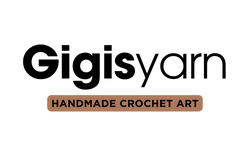

## About Gigis Yarn
Gigis Yarn is designed to act like a gallery for my crochet artwork. On the site you will find handmade baby toys and accessories, these items can also be customized and purchased. 

The site features a clear and simpel design that includes a navbar at the top next to the logo. In the navbar there is a menu (burger-menu for mobile-devices and buttons for other larger devices) with three buttons – Home, Photos and Contact. There is also a footer containing working icons of Facebook, Instagram and Contact.  

Homepage: Contains a description of Gigis Yarn. 
Photos: Shows photos of my previous works. 
Contact: A form to contact me. 

## User Stories

### First time visitors:
An inspirational page for someone interested in crochet.
Puschase finished products or the pattern. 
Contact me for any requests or questions.

### Returning visitors:
Find inspiration from updated information/images
Purchase finished products and patterns

### Others: 
Potentional customer wanting to know prices and what else is offered

## Site Administrator
The site should be organised, easy to navigate and to update information.

## Design

### Colour scheme
- #AD795B
- #FAFAF8
![Color palette][assets/images/color_palette.png]
Color palette created using Canva.
The colors are very neutral with a lot of brown and beige colors, this is to match all the colors in the photos and let the photos "decorate" the site. 

### Font family
For the logo (made in Canva) I used ITC Avant Garde Gothic and Gothham.
For the rest of the site I used the linked Google Fonts with Poppins and the the fallback font is sans-serif. 
Bold was used mainly on the button texts with a weight of 900. 

## Languages and resources:
- HTML5 Markup language, used to make the site 
- CSS Used to style most parts of the site 
- Github Repository 
- Gitpod IDE to make the site 
- FontAwesome Where icons on the site is used from 
- Favicon Where icon in tab is used from 
- Google Fonts Where I have taken the fonts from 
- Balwamiq Wireframes Program to create wireframes 
- Canva Program to make hero-image and logo 

## Media
- The logo was made by me in Canva. The hero-image was also made by me in Canva with photo included in for Canva Pro. 
- All other photos were photographed and edited by me and was taken from my Instagram account @gigisyarn. 

## Sources
- Love Running Walkthrough Project from Code Institute

- Center image (Page 1):
https://www.w3schools.com/howto/howto_css_image_center.asp

- Color picker (For the background): 
https://htmlcolorcodes.com/

- Button to Gallery: 
https://www.w3schools.com/tags/tag_button.asp

- Style submit button:
https://stackoverflow.com/questions/38149704/why-does-the-text-inside-an-input-tag-get-cut-off-even-if-theres-already-a-pa

## Wireframe
The outcome from the Wireframes I made at the beginning has changed a bit from how the end product looked like. Nothing major, changed text-content placement etc. 

## W3C Validator
Tested 2023-03-01, result: 
Index page
- Could not have an <a> as a decendant to <button> 
- Changed my <section> to 
 since I'm not using a header and only h2.
Gallery page
- Same issue with the button since I used the same code. 
- Changed my <section> to 
 since I'm not using a header and only h2.
- I had a 
 without a closing tag
Contact page
- Changed my <section> to 
 since I'm not using a header and only h2. 
Thank you page
- <button> issue and <section> issue, the same as the other pages. 

CSS Stylesheet
- Forgot to put px after a unit

All issues has been taken care of and there are no more errors or warnings. 

[assets/images/color_palette.png]: assets/images/color_palette.png