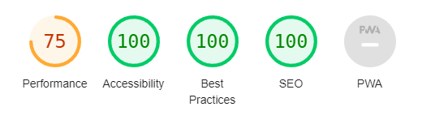
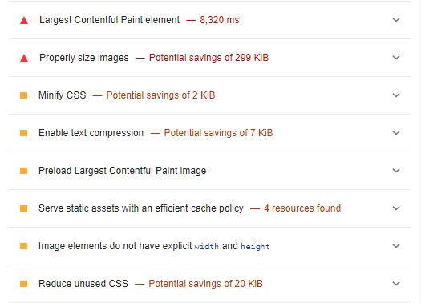
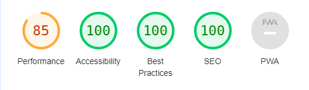
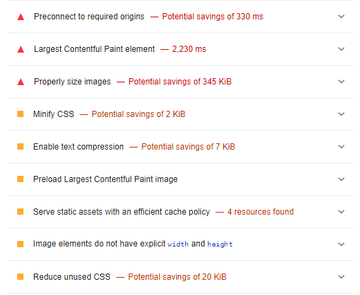
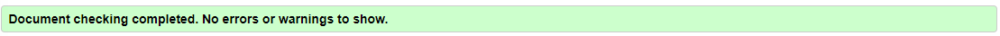
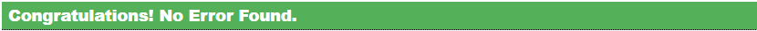
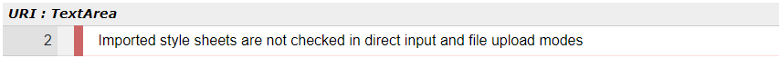

# Testing

Test have been an ongoing procedure under the entire build of the site. I used Google Chrome and the DevTool to locate and troubleshoot any issues. DevTool helped me locate the issue in my HTML or CSS either in code or the box-model. The closer I got to a finished product the more I tested the site. 

I've tested the site multiple times using DevTools and different devices to make sure the website is responsiv. When using the DevTools Dimensions I mainly chose between: 
- Responsiv
- Desktop
- Iphone 12 Pro
- Samsung Galaxy S8
- Ipad Mini
- Asus Zenbook Fold
The tests were made on each page of the site testing the funtions as well. 

Following tools were also used for testing: 
- W3C HTML Validator
- W3C CSS Validator
- WAVE Web Accessibility tool

The most recents tests can be found below:

## W3C Validator
Tested 2023-03-01, result: 
### Index page
- Could not have an a tag as a decendant to button tag. This was solved by putting only an a href-tag ad styling it. 
- Changed my section tag to div tag since I'm not using a header and only h2.
### Gallery page
- Same issue with the button since I used the same code. 
- Changed my section tag to div tag since I'm not using a header and only h2.
- I had a div tag without a closing tag
### Contact page
- Changed my section tag to div tag since I'm not using a header and only h2. 
### Thanks page
- button tag issue and section tag issue, the same as the other pages. 

### CSS Stylesheet
- Forgot to put px after a unit

All issues has been taken care of and there are no more errors or warnings. 

## Lighthouse testing
2023-03-02, result: 

### Mobile version:

After the first run I had some errors on the Performance (70) and Accessibility (82). 

My first choice of color was a lighter brown (#AD795B) combined with a back font color. I used a color contrast tool (linked in my resources) and picked a slightly darker brown (#714C42)with a white font color instead. I also changed the logo to the same brown to match the rest of the site, this I did in Canva since I designed the logo myself. 

After those changes my Accessibility came up to 100. 

My Performance was still on 70 and Lighthouse recommended to change my images from png to webp, which I did using a converter (also linked in my resources). This made my Performance board to go up to 75. Main problem is still my header/hero image. 

Lightroom also cautioned about my logo (an image) and wanted it to be 375x225px instead of 250x150px. So I changed it the larger size and used my media query to change the size depending on device. 

### Desktop version:

The desktop came back with a better result. The Performance is still not where I want it to be but 85 is better than the mobile versions 75. I ran the mobile version and fixed the errors the best I could. This most likely has effected the results for the desktop results as I ran that after.

### W3C Validator 
2023-03-02: Tested the site again after testing it on Lighthouse, no errors were found. 

One warning: 

## Full testing 
Results 2023-03-04:

The test was performed on the following devices and browsers:
- Lenovo IdeaPad 1 14ADA7: Google Chrome and Microsoft Edge
- Ipad Mini 4: Safari app
- Ipone 11 Pro Max: Safari app
- Google Pixel 7 Pro: Google Chrome app
- LG Ultrawide Monitor 29"
- Samsung Galaxy S24: Samsung Internet Browser

The functions vary depending on what device the test was performed on. 
For e.g. Click Facebook button can either redirect to new tab or open in app. 

No bugs were found. 

| FEATURES                      | EXPECTED OUTCOME                               | TESTING PERFOMED        | RESULT                                         | PASS/FAIL |
|-------------------------------|------------------------------------------------|-------------------------|------------------------------------------------|-----------|
| INDEX PAGE                    |                                                |                         |                                                |           |
| Logo image link               | Image is linked back to Home page              | Clicked logo            | Redirected back to the Home page               | Pass      |
| Nav bar Home link             | Click link to redirect to Home page            | Clicked link            | Redirected to Home page                        | Pass      |
| Nav bar Home Active button    | Underlined when visiting Home page             | Visited Home page       | Home link underlined                           | Pass      |
| Nav bar Gallery link          | Click link to redirect to Gallery page         | Clicked link            | Redirected to Gallery page                     | Pass      |
| Nav bar Contact link          | Click link to redirect to Contact page         | Clicked link            | Redirected to Contact page                     | Pass      |
| Gallery button                | Click button to redirect to Gallery page       | Clicked button          | Redirected to Gallery page                     | Pass      |
| Gallery button (hover)        | When hover the text color goes black           | Hover                   | Text color went black                          | Pass      |
| Facebook icon button          | Redirected to FB page in new tab or app        | Clicked icon            | Redirected to FB page in new tab or app        | Pass      |
| Instagram icon button         | Redirected to Instagram page in new tab or app | Clicked icon            | Redirected to Instagram page in new tab or app | Pass      |
| Contact icon button           | Redirected to Contact page                     | Clicked icon            | Redirected to Contact page                     | Pass      |
|                               |                                                |                         |                                                |           |
| GALLERY PAGE                  |                                                |                         |                                                |           |
| Logo image link               | Image is linked back to Home page              | Clicked logo            | Redirected back to the Home page               | Pass      |
| Nav bar Home link             | Click link to redirect to Home page            | Clicked link            | Redirected to Home page                        | Pass      |
| Nav bar Gallery link          | Click link to redirect to Gallery page         | Clicked link            | Redirected to Gallery page                     | Pass      |
| Nav bar Gallery Active button | Underlined when visiting Gallery page          | Visited Gallery page    | Gallery link underlined                        | Pass      |
| Nav bar Contact link          | Click link to redirect to Contact page         | Clicked link            | Redirected to Contact page                     | Pass      |
| Contact button                | Click button to redirect to Contact page       | Clicked button          | Redirected to Contact page                     | Pass      |
| Contact button (hover)        | When hover the text color goes black           | Hover                   | Text color went black                          | Pass      |
| Facebook icon button          | Redirected to FB page in new tab or app        | Clicked icon            | Redirected to FB page in new tab or app        | Pass      |
| Instagram icon button         | Redirected to Instagram page in new tab or app | Clicked icon            | Redirected to Instagram page in new tab or app | Pass      |
| Contact icon button           | Redirected to Contact page                     | Clicked icon            | Redirected to Contact page                     | Pass      |
|                               |                                                |                         |                                                |           |
| CONTACT PAGE                  |                                                |                         |                                                |           |
| Logo image link               | Image is linked back to Home page              | Clicked logo            | Redirected back to the Home page               | Pass      |
| Nav bar Home link             | Click link to redirect to Home page            | Clicked link            | Redirected to Home page                        | Pass      |
| Nav bar Gallery link          | Click link to redirect to Gallery page         | Clicked link            | Redirected to Gallery page                     | Pass      |
| Nav bar Contact link          | Click link to redirect to Contact page         | Clicked link            | Redirected to Contact page                     | Pass      |
| Nav bar Contact Active button | Underlined when visiting Contact page          | Visited Contact page    | Contact link underlined                        | Pass      |
| Form for name and email       | Name is required to be filled to submit        | Added my name and email | Could be submitted                             | Pass      |
| Textarea for requests         | Add text to the form                           | Added text to textarea  | Text was added to textarea                     | Pass      |
| Submit button                 | Redirected to Thanks page                      | Clicked button          | Redirected to Thanks page                      | Pass      |
| Facebook icon button          | Redirected to FB page in new tab or app        | Clicked icon            | Redirected to FB page in new tab or app        | Pass      |
| Instagram icon button         | Redirected to Instagram page in new tab or app | Clicked icon            | Redirected to Instagram page in new tab or app | Pass      |
| Contact icon button           | Redirected to Contact page                     | Clicked icon            | Redirected to Contact page                     | Pass      |
|                               |                                                |                         |                                                |           |
| THANKS PAGE                   |                                                |                         |                                                |           |
| Logo image link               | Image is linked back to Home page              | Clicked logo            | Redirected back to the Home page               | Pass      |
| Nav bar Home link             | Click link to redirect to Home page            | Clicked link            | Redirected to Home page                        | Pass      |
| Nav bar Gallery link          | Click link to redirect to Gallery page         | Clicked link            | Redirected to Gallery page                     | Pass      |
| Nav bar Contact link          | Click link to redirect to Contact page         | Clicked link            | Redirected to Contact page                     | Pass      |
| Homepage button               | Click button to redirect back to Home page     | Clicked button          | Redirected back to the Home page               | Pass      |
| Homepage button (hover)       | When hover the text color goes black           | Hover                   | Text color went black                          | Pass      |
| Facebook icon button          | Redirected to FB page in new tab or app        | Clicked icon            | Redirected to FB page in new tab or app        | Pass      |
| Instagram icon button         | Redirected to Instagram page in new tab or app | Clicked icon            | Redirected to Instagram page in new tab or app | Pass      |
| Contact icon button           | Redirected to Contact page                     | Clicked icon            | Redirected to Contact page                     | Pass      |
|                               |                                                |                         |                                                |           |
| Bugs known: 0                 |                                                |                         |                                                |           |
| Solved Bugs: 0                |                                                |                         |                                                |           |